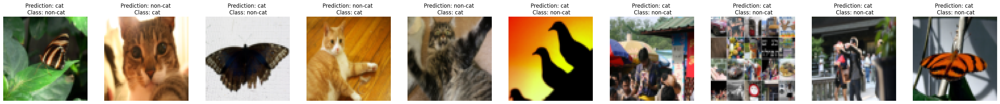

# Image Classification from Scratch

This repository demonstrates how to perform image classification from scratch, starting with JPEG image files on disk, without relying on pre-trained weights or pre-made Keras Application models. We showcase this workflow using the Kaggle Cats vs Dogs binary classification dataset.

## Introduction

Image classification is a fundamental task in computer vision, where the goal is to assign a label or category to an image. In this project, we focus on a binary classification problem: distinguishing between images of cats and dogs. Instead of using pre-trained models, we build a deep learning model from scratch to learn features directly from the dataset.

## Dataset

We utilize the Kaggle Cats vs Dogs dataset, which consists of thousands of labeled images of cats and dogs. You can download the dataset from [here](https://www.kaggle.com/c/dogs-vs-cats/data). Make sure to organize the dataset into training and testing subsets as needed.

## Requirements

Before running the code in this repository, ensure you have the following dependencies installed:

- Python 3.x
- TensorFlow 2.x
- NumPy
- Matplotlib

## Usage

1. **Deep_Neural_network_from_the_ground_up** 
    This project implement a deep learning model without using Keras or Tensorflow. The program determine from a dataset of image if it is a cat or not.
    * The results have a training accuracy of 99.9999% and a test accuracy of 70%
    <figure>
   
    </figure>

2. **Tensorflow_Implementation_NN** 
    This project implement using Keras Tensorflow. The program determine from a dataset of image if it is a cat or or dog.
    * The first version uses my own PC (i9-12900K, RTX 3080 10GB),the size of the NN are [2,4,8,16,32] due to resources limitations. The program took 5m 31.9s to complete. Final accurcy 0.7151.
    * The Colab version uses Google Colab Python 3 Google Compute Engine backend (GPU),the size of the NN are [128,256,512,728,1024]. The program took 2h to complete. Final accurcy 0.9689.

## License

This project is licensed under the MIT License

## Acknowledgments

- Kaggle for providing the Cats vs Dogs dataset for this project.
- The TensorFlow and Keras communities for their valuable contributions to deep learning.
